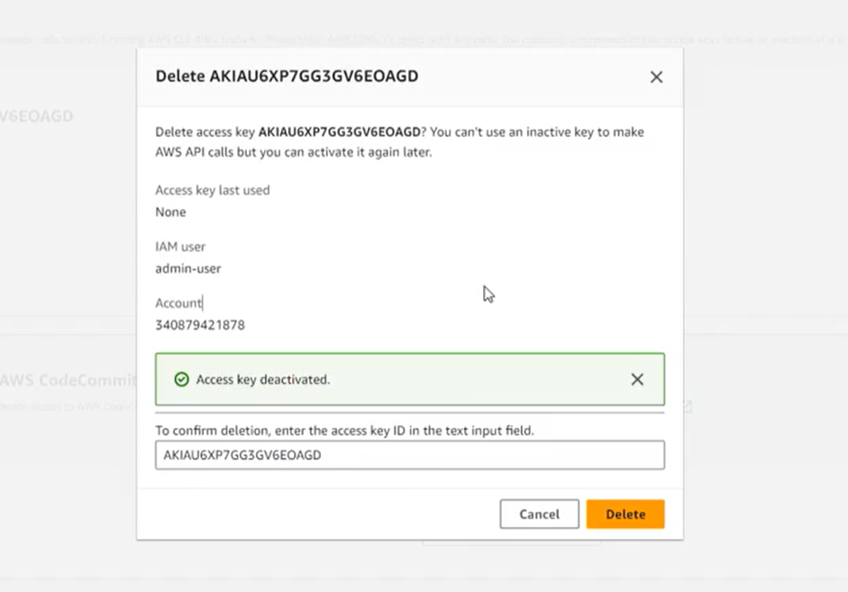
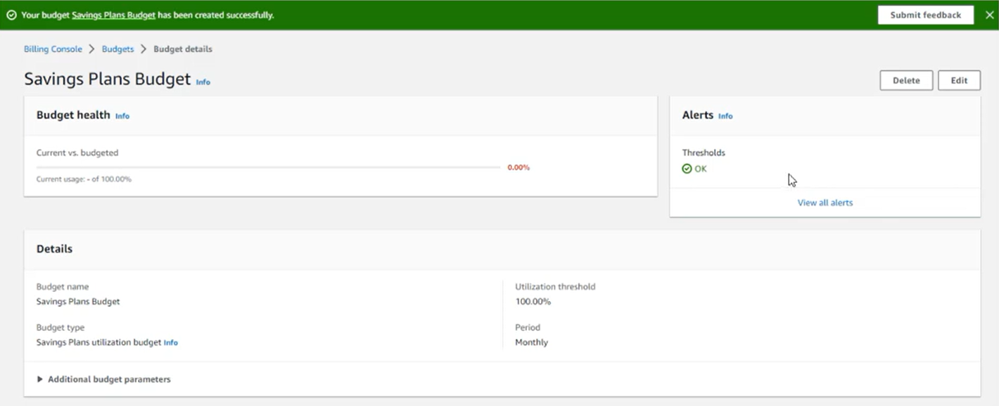

### Week 2 Objectives:

- Explore Amazon Virtual Private Cloud (Amazon VPC) and core networking components in AWS.
- Understand network security mechanisms including Security Groups, Network ACLs, and AWS Site-to-Site VPN.
- Practice managing IAM credentials and Access Keys to enhance AWS account security.
- Learn about AWS Budgets to track, monitor, and control cloud spending.
- Explore AWS Support plans and the process of creating support cases on AWS.

### Tasks to Implement This Week:

| Day | Task | Start Date | Completion Date | Resource |
| --- | --- | --- | --- | --- |
| Mon | - Overview of Amazon VPC and fundamental networking components. - Practice managing IAM User Access Keys to enhance AWS account security. | 27/04/2026 | 27/04/2026 | https://000003.awsstudygroup.com/vi/ |
| Tue | - Learn about AWS Budgets and budget types (Cost, Usage, RI, Savings Plans). - Practice creating a Savings Plans Budget and setting up cost alerts. | 28/04/2026 | 28/04/2026 | https://000007.awsstudygroup.com/vi/ |
| Wed | - Understand Security Groups, Network ACLs, and AWS Site-to-Site VPN architecture. - Grasp the role of security components within Amazon VPC. | 29/04/2026 | 29/04/2026 | https://000003.awsstudygroup.com/vi/ |
| Thu | - Explore AWS Support plans and the response times associated with each plan. - Compare Basic, Developer, Business, and Enterprise Support. | 30/04/2026 | 30/04/2026 | https://000009.awsstudygroup.com/vi/ |
| Fri | - Practice creating an AWS Support Case. - Learn the workflow for submitting and managing support requests via the AWS Management Console. | 01/05/2026 | 01/05/2026 | https://000009.awsstudygroup.com/vi/ |

### Week 2 Achievements:

| Day | Task | Key Achievements | Image |
| --- | --- | --- | --- |
| Mon | IAM Credential Management | Successfully practiced deactivating and deleting unused Access Keys for an IAM User, enhancing overall AWS account security and mitigating leakage risks. |  |
| Tue | Cost Management with AWS Budgets | Successfully configured a Savings Plans Budget, established custom cost alert thresholds, and monitored consumption trends to control operational budgets on AWS. |  |
| Wed | Amazon VPC and Site-to-Site VPN | Grasped the Amazon VPC networking architecture, the structural roles of Security Groups and Network ACLs, and the operational mechanics of Site-to-Site VPN connections between On-premises environments and AWS Cloud. | |
| Thu | AWS Support | Learned the distinctive features of various AWS Support plans, highlighting differences in technical support scope and response timeframes to evaluate the right fit for business needs. | |
| Fri | AWS Support Case | Practiced creating a new support request (Support Case) inside the AWS Management Console and walked through the standard lifecycle of ticket resolution handled by AWS Support. | |