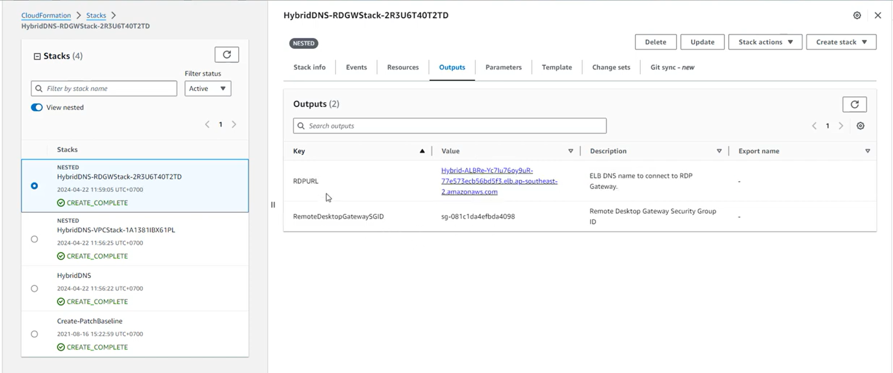
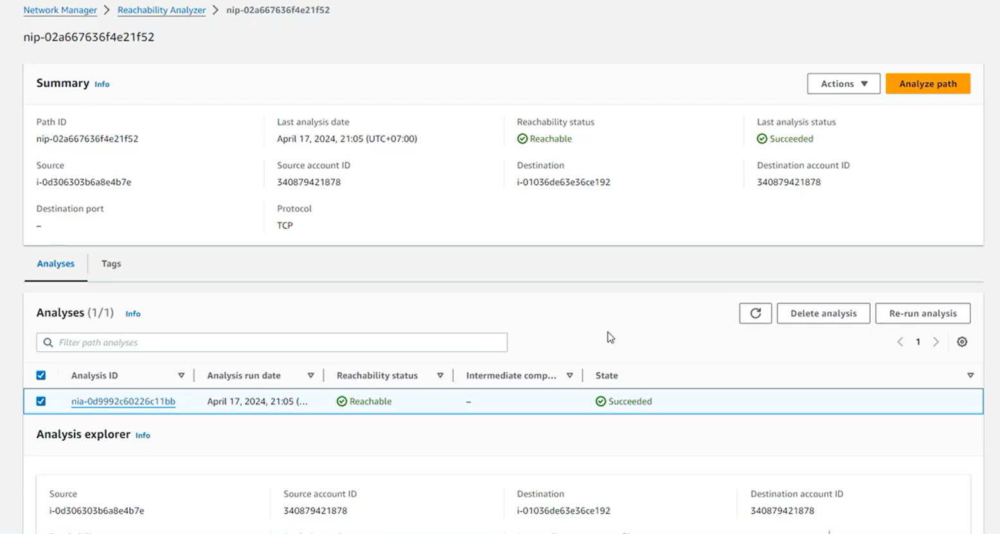
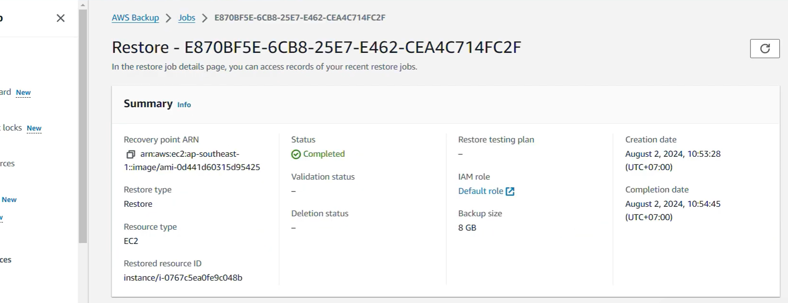
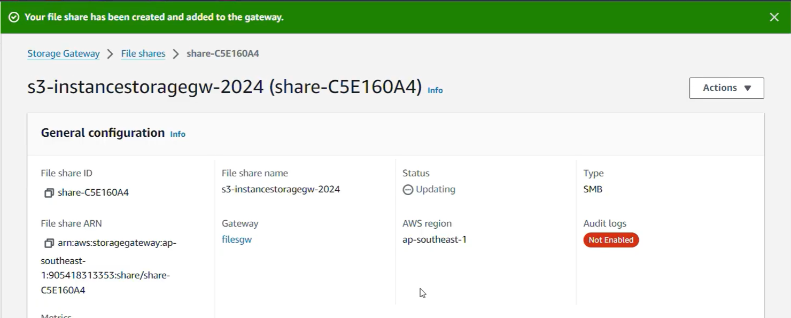

### Mục tiêu tuần 3:

- Tìm hiểu các giải pháp kết nối và quản lý hạ tầng mạng trên AWS.
- Thực hành triển khai Hybrid DNS với Amazon Route 53 Resolver.
- Thực hành kiểm tra kết nối mạng bằng Reachability Analyzer.
- Tìm hiểu AWS Backup và thực hiện sao lưu, khôi phục dữ liệu.
- Triển khai AWS Storage Gateway để kết nối lưu trữ giữa môi trường On-premise và Amazon S3.

### Các công việc cần triển khai trong tuần này:

| Thứ | Công việc | Ngày bắt đầu | Ngày hoàn thành | Nguồn tài liệu |
| --- | --- | --- | --- | --- |
| 2 | - Tìm hiểu kiến trúc Hybrid DNS và Amazon Route 53 Resolver. - Thực hành triển khai hạ tầng bằng AWS CloudFormation. | 04/05/2026 | 04/05/2026 | https://000010.awsstudygroup.com/vi/ |
| 3 | - Tìm hiểu AWS Reachability Analyzer. - Thực hành phân tích đường truyền và kiểm tra khả năng kết nối giữa các tài nguyên trong VPC. | 05/05/2026 | 05/05/2026 | https://000057.awsstudygroup.com/vi/ |
| 4 | - Tìm hiểu AWS Backup. - Tạo Backup Plan và thực hiện khôi phục EC2 từ Recovery Point. | 06/05/2026 | 06/05/2026 | https://000013.awsstudygroup.com/vi/ |
| 5 | - Tìm hiểu AWS Storage Gateway. - Triển khai File Storage Gateway và tạo SMB File Share kết nối Amazon S3. | 07/05/2026 | 07/05/2026 | https://000014.awsstudygroup.com/vi/ |
| 6 | - Thực hành kết nối máy On-premise với SMB File Share. - Kiểm tra khả năng đọc, ghi và đồng bộ dữ liệu lên Amazon S3. | 08/05/2026 | 08/05/2026 | https://000014.awsstudygroup.com/vi/ |
| 7 | - Kiểm tra trạng thái hoạt động của Storage Gateway. - Xác minh dữ liệu trên Amazon S3 và dọn dẹp tài nguyên sau khi hoàn thành bài Lab. | 09/05/2026 | 09/05/2026 | https://000014.awsstudygroup.com/vi/ |

### Kết quả đạt được tuần 3:

| Thứ | Công việc | Kết quả đạt được | Hình ảnh |
| --- | --- | --- | --- |
| 2 | Triển khai Hybrid DNS với Amazon Route 53 | Triển khai thành công mô hình Hybrid DNS bằng AWS CloudFormation. Các Nested Stack ở trạng thái **CREATE_COMPLETE**, đồng thời nhận được các thông tin Output như RDPURL và Security Group của Remote Desktop Gateway. |  |
| 3 | Kiểm tra kết nối bằng Reachability Analyzer | Thực hiện phân tích kết nối giữa các tài nguyên trong VPC bằng AWS Reachability Analyzer. Kết quả trả về trạng thái **Reachable** và **Succeeded**, xác nhận cấu hình mạng hoạt động chính xác. |  |
| 4 | Sao lưu và khôi phục EC2 bằng AWS Backup | Tạo và thực hiện thành công quá trình khôi phục EC2 từ Recovery Point. Hệ thống hoàn tất Restore với trạng thái **Completed** và tạo lại EC2 Instance dung lượng 8 GB. |  |
| 5 | Triển khai AWS Storage Gateway | Tạo thành công SMB File Share trên AWS Storage Gateway và kết nối với Amazon S3 để lưu trữ dữ liệu. |  |
| 6 | Kết nối File Share | Kết nối thành công máy On-premise với SMB File Share, thực hiện đọc, ghi dữ liệu và xác nhận dữ liệu được đồng bộ lên Amazon S3. | |
| 7 | Kiểm tra và dọn dẹp tài nguyên | Kiểm tra trạng thái hoạt động của Storage Gateway, xác minh dữ liệu được lưu trữ trên Amazon S3 và xóa các tài nguyên đã triển khai để tránh phát sinh chi phí. | |