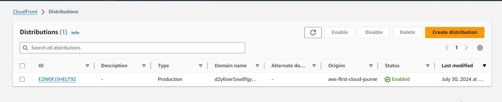
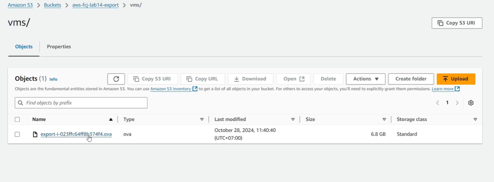

### Week 4 Objectives:

- Explore Amazon S3 storage solutions and its vital features.
- Practice configuring S3 Cross-Region Replication to synchronize data across different Regions.
- Study the AWS Backup ecosystem along with the data backup and restoration lifecycle.
- Learn about VM Import/Export mechanics and deploy Amazon FSx for Windows File Server.

### Tasks to Implement This Week:

| Day | Task | Start Date | Completion Date | Resource |
| --- | --- | --- | --- | --- |
| Mon | - Overview of Amazon S3 architecture. - Research Buckets, Objects, and various S3 Storage Classes. | 11/05/2026 | 11/05/2026 | https://000013.awsstudygroup.com/vi/ |
| Tue | - Practice creating Buckets and uploading Objects. - Explore Object Versioning and Lifecycle Management policies. | 12/05/2026 | 12/05/2026 | https://000014.awsstudygroup.com/vi/ |
| Wed | - Practice configuring S3 Cross-Region Replication. - Set up explicit Replication Rules to sync data automatically between two distinct Regions. | 13/05/2026 | 13/05/2026 | https://000057.awsstudygroup.com/vi/ |
| Thu | - Learn about AWS Backup management. - Create a standard Backup Plan and provision a secure Backup Vault. | 14/05/2026 | 14/05/2026 | https://000025.awsstudygroup.com/vi/ |
| Fri | - Practice restoring data from an active AWS Backup recovery point. - Learn how AWS SNS sends alert notifications upon backup task completion. | 15/05/2026 | 15/05/2026 | https://000025.awsstudygroup.com/vi/ |
| Sat | - Study the specifications of VM Import/Export. - Practice deploying and configuring Amazon FSx for Windows File Server. | 16/05/2026 | 16/05/2026 | https://000025.awsstudygroup.com/vi/ |

---

### Week 4 Achievements:

| Day | Task | Key Achievements | Image |
| --- | --- | --- | --- |
| Mon | Exploring Amazon S3 | Grasped the object storage architecture of Amazon S3, including the distinctions between Buckets and Objects, storage tier classes, and basic bucket security features. |  |
| Tue | Managing S3 Buckets | Successfully created S3 buckets, performed object uploads, configured Versioning, and got hands-on experience with Lifecycle Management to control data retention efficiently. |  |
| Wed | S3 Cross-Region Replication | Successfully established S3 Replication Rules to automate data synchronization between two targeted Regions, acquiring a solid understanding of data redundancy and Disaster Recovery strategies on AWS. |  |
| Thu | Deploying Amazon CloudFront | Successfully uploaded a virtual machine image template (.ova file) to Amazon S3 in preparation for the VM Import/Export operations. Grasped the workflow of storing VM images securely within S3 before provisioning them as Amazon EC2 instances. |  |
| Fri | Executing VM Import/Export | Successfully uploaded the virtual machine backup template (.ova file) into the target Amazon S3 bucket for the VM Import/Export pipeline. Evaluated the proper lifecycle stages of virtual system conversion into production-ready EC2 images. |  |
| Sat | VM Import/Export & Amazon FSx | Mastered the conceptual workflow of moving on-premises virtual instances to AWS EC2 via VM Import/Export. Explored Amazon FSx for Windows File Server architectures, set up distributed network file shares, and administered shared storage capacities. |  |