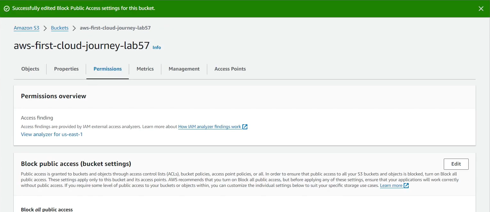
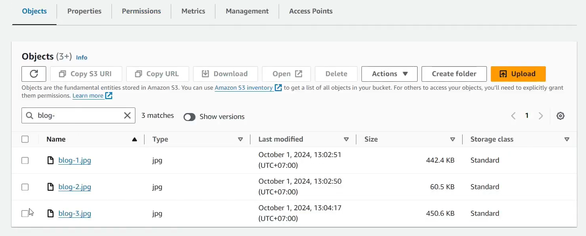
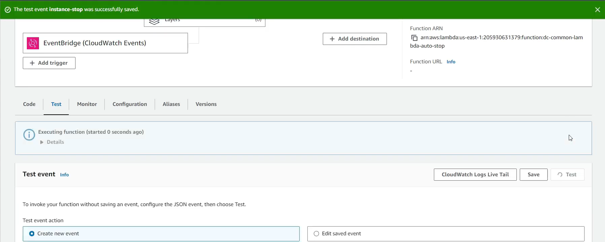

### Week 5 Objectives:

- Explore Amazon Simple Storage Service (Amazon S3) and object storage mechanics.
- Practice deploying Static Website Hosting using Amazon S3 buckets.
- Understand data replication across different Regions using S3 Cross-Region Replication (CRR).
- Learn about AWS Security Hub and how to monitor the security posture of an AWS account.
- Practice using AWS Lambda combined with Amazon EventBridge to automate EC2 instance management for cost optimization.

### Tasks to Implement This Week:

| Day | Task | Start Date | Completion Date | Resource |
| --- | --- | --- | --- | --- |
| Mon | - Overview of Amazon S3 architecture, S3 Buckets, and Objects. - Create an S3 Bucket and configure Block Public Access policies. | 18/05/2026 | 18/05/2026 | https://000057.awsstudygroup.com/vi/ |
| Tue | - Configure Static Website Hosting on the designated Amazon S3 bucket. - Upload Objects and verify the accessibility of the hosted static website. | 19/05/2026 | 19/05/2026 | https://000057.awsstudygroup.com/vi/ |
| Wed | - Practice configuring S3 Cross-Region Replication (CRR). - Verify real-time data replication between two S3 Buckets located in different Regions. | 20/05/2026 | 20/05/2026 | https://000057.awsstudygroup.com/vi/ |
| Thu | - Learn about the features of AWS Security Hub. - Enable Security Hub and monitor generated Security Findings and Security Standards compliance. | 21/05/2026 | 21/05/2026 | https://000018.awsstudygroup.com/vi/ |
| Fri | - Study AWS Lambda functionalities integrated with Amazon EventBridge. - Build an automated Lambda Function triggered by EventBridge events to Start/Stop EC2 instances for cost efficiency. | 22/05/2026 | 22/05/2026 | https://000022.awsstudygroup.com/vi/ |
| Sat | - Test and validate the runtime operations of the Lambda Function and EventBridge rules. - Audit Static Website Hosting status, verify Cross-Region Replication sync, and finalize service deployments. | 23/05/2026 | 23/05/2026 | https://000022.awsstudygroup.com/vi/ |

### Week 5 Achievements:

| Day | Task | Key Achievements | Image |
| --- | --- | --- | --- |
| Mon | Configuring Amazon S3 Buckets | Successfully provisioned an S3 Bucket and configured Block Public Access settings to enforce data access control matching AWS security best practices. |  |
| Tue | Uploading S3 Objects | Successfully uploaded required Objects to the S3 Bucket and validated that the data is accurately stored and structured for Static Website Hosting. |  |
| Wed | S3 Cross-Region Replication | Successfully established S3 Replication Rules between target buckets across separate Regions, enabling automatic data syncing for redundancy and Disaster Recovery strategies. | |
| Thu | AWS Security Hub | Activated AWS Security Hub on the account, exploring how to aggregate continuous Security Findings and evaluate global security standard compliance metrics. | |
| Fri | Optimizing EC2 Costs with AWS Lambda | Successfully developed and tested a Lambda Function triggered by Amazon EventBridge rules to automate EC2 Start/Stop scheduling, cutting down cloud infrastructure operations costs. |  |
| Sat | Verifying and System Finalization | Evaluated the live endpoint for Static Website Hosting, audited data transfer sync completion between Regions via Cross-Region Replication, and verified the successful execution logs of the automated Lambda actions. | |