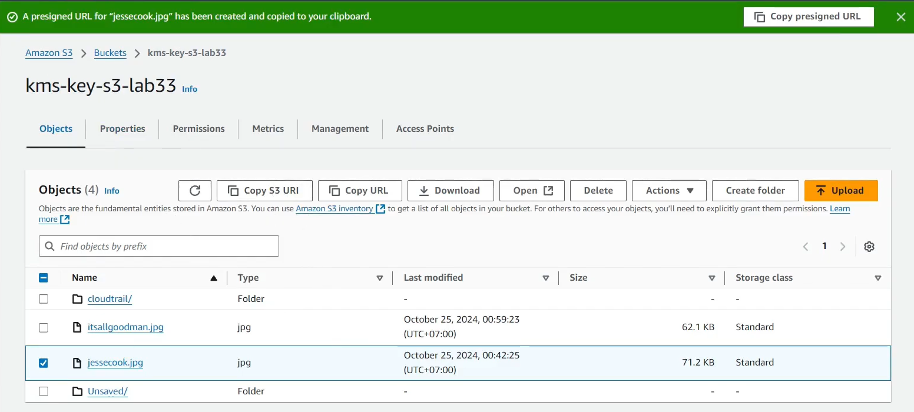
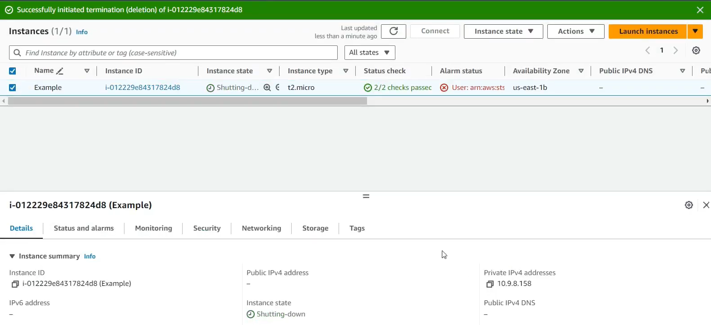

### Mục tiêu tuần 6:

- Tìm hiểu cách quản lý tài nguyên bằng AWS Tag và Resource Groups.
- Thực hành kiểm soát quyền truy cập EC2 thông qua IAM Policy kết hợp Resource Tag.
- Tìm hiểu cơ chế IAM Permission Boundary để giới hạn quyền tối đa của người dùng.
- Thực hành mã hóa dữ liệu trên Amazon S3 bằng AWS KMS, ghi nhật ký với CloudTrail và kiểm thử chia sẻ dữ liệu bằng Presigned URL.

### Các công việc cần triển khai trong tuần này:

| Thứ | Công việc | Ngày bắt đầu | Ngày hoàn thành | Nguồn tài liệu |
| --- | --- | --- | --- | --- |
| 2 | - Tìm hiểu AWS Tag và Resource Groups. - Thực hành gán Tag cho tài nguyên và tạo Resource Group để quản lý theo nhóm. | 25/05/2026 | 25/05/2026 | https://000027.awsstudygroup.com/vi/ |
| 3 | - Tìm hiểu quản lý quyền EC2 bằng IAM kết hợp Resource Tag. - Thực hành tạo IAM Policy, IAM Role và kiểm tra quyền truy cập theo Tag. | 26/05/2026 | 26/05/2026 | https://000028.awsstudygroup.com/vi/ |
| 4 | - Tìm hiểu IAM Permission Boundary. - Thực hành tạo Permission Boundary và kiểm tra giới hạn quyền của IAM User. | 27/05/2026 | 27/05/2026 | https://000030.awsstudygroup.com/vi/ |
| 5 | - Tìm hiểu AWS KMS và mã hóa dữ liệu trên Amazon S3. - Tạo KMS Key và cấu hình S3 sử dụng khóa mã hóa. | 28/05/2026 | 28/05/2026 | https://000033.awsstudygroup.com/vi/ |
| 6 | - Thực hành CloudTrail ghi nhận hoạt động và sử dụng Presigned URL để chia sẻ tệp được lưu trên Amazon S3. - Kiểm tra khả năng truy cập đối tượng đã mã hóa. | 29/05/2026 | 29/05/2026 | https://000033.awsstudygroup.com/vi/ |
| 7 | - Dọn dẹp tài nguyên sau khi hoàn thành các bài Lab. - Xóa EC2 Instance, kiểm tra lại các dịch vụ đã tạo để tránh phát sinh chi phí trên AWS. | 30/05/2026 | 30/05/2026 | AWS Study Group |

### Kết quả đạt được tuần 6:

| Thứ | Công việc | Kết quả đạt được | Hình ảnh |
| --- | --- | --- | --- |
| 2 | Quản lý tài nguyên bằng Tag và Resource Groups | Hiểu cách sử dụng Tag để phân loại tài nguyên AWS, tạo Resource Group nhằm quản lý nhiều tài nguyên theo cùng một nhóm, hỗ trợ tìm kiếm và quản trị hiệu quả. | |
| 3 | Quản lý quyền bằng Resource Tag | Thực hành tạo IAM Policy và IAM Role sử dụng Resource Tag để kiểm soát quyền truy cập EC2 theo nguyên tắc đặc quyền tối thiểu (Least Privilege). | |
| 4 | IAM Permission Boundary | Hiểu cơ chế Permission Boundary, thực hành giới hạn quyền tối đa của IAM User nhằm ngăn chặn việc mở rộng quyền ngoài phạm vi cho phép. | |
| 5 | AWS KMS và mã hóa dữ liệu | Tạo KMS Key, cấu hình Amazon S3 sử dụng khóa mã hóa và tìm hiểu cách CloudTrail ghi nhận các hoạt động liên quan đến dữ liệu được mã hóa. | |
| 6 | Chia sẻ dữ liệu bằng Presigned URL | Tạo thành công Presigned URL để chia sẻ tệp được lưu trên Amazon S3 mà vẫn đảm bảo dữ liệu được bảo vệ bằng AWS KMS và quyền truy cập có thời hạn. |  |
| 7 | Dọn dẹp tài nguyên | Xóa EC2 Instance và các tài nguyên đã sử dụng trong quá trình thực hành nhằm tránh phát sinh chi phí không cần thiết trên tài khoản AWS. |  |