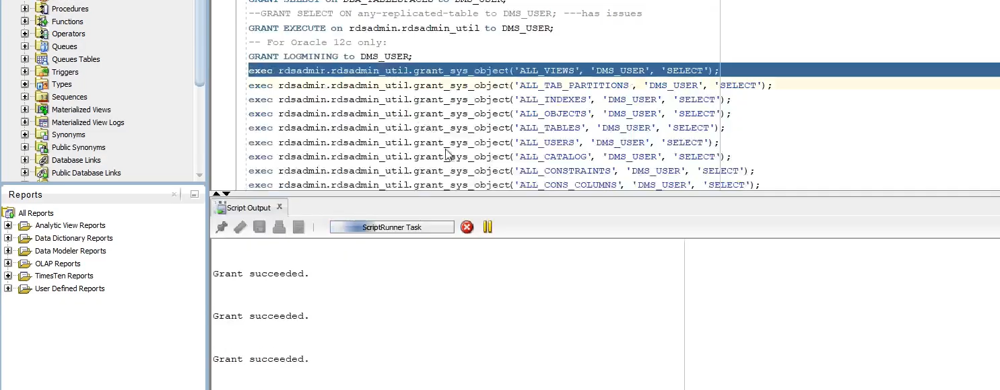
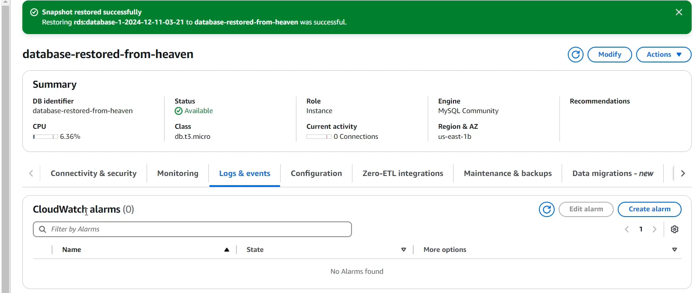

### Mục tiêu tuần 7:

- Tìm hiểu cách áp dụng IAM Role và IAM Condition để giới hạn quyền truy cập theo nguyên tắc Least Privilege.
- Thực hành cấp quyền cho ứng dụng EC2 thông qua IAM Role thay vì sử dụng Access Key.
- Tìm hiểu quy trình chuyển đổi lược đồ và di dời cơ sở dữ liệu bằng AWS SCT và AWS DMS.
- Khám phá kiến trúc Data Lake trên AWS và thực hành phân tích dữ liệu với Glue, Athena và QuickSight.

### Các công việc cần triển khai trong tuần này:

| Thứ | Công việc | Ngày bắt đầu | Ngày hoàn thành | Nguồn tài liệu |
| --- | --- | --- | --- | --- |
| 2 | - Tìm hiểu IAM Role, IAM Condition và nguyên tắc cấp quyền tối thiểu (Least Privilege). - Thực hành tạo IAM Group, IAM User, IAM Role và cấu hình điều kiện truy cập theo IP, thời gian. | 01/06/2026 | 01/06/2026 | https://000044.awsstudygroup.com/vi/ |
| 3 | - Thực hành cấp quyền cho ứng dụng EC2 bằng IAM Role. - So sánh phương pháp sử dụng Access Key và IAM Role khi ứng dụng truy cập dịch vụ AWS. | 02/06/2026 | 02/06/2026 | https://000048.awsstudygroup.com/vi/ |
| 4 | - Tìm hiểu AWS Schema Conversion Tool (AWS SCT). - Thực hành chuyển đổi lược đồ cơ sở dữ liệu và tìm hiểu quy trình di dời dữ liệu bằng AWS Database Migration Service (AWS DMS). | 03/06/2026 | 03/06/2026 | https://000043.awsstudygroup.com/vi/ |
| 5 | - Tìm hiểu kiến trúc Data Lake trên AWS. - Thực hành thu thập dữ liệu, tạo Data Catalog bằng AWS Glue và truy vấn dữ liệu với Amazon Athena. | 04/06/2026 | 04/06/2026 | https://000035.awsstudygroup.com/vi/ |
| 6 | - Thực hành trực quan hóa dữ liệu bằng Amazon QuickSight. - Hoàn thiện quy trình phân tích dữ liệu trên kiến trúc Data Lake. | 05/06/2026 | 05/06/2026 | https://000035.awsstudygroup.com/vi/ |

### Kết quả đạt được tuần 7:

| Thứ | Công việc | Kết quả đạt được | Hình ảnh |
| --- | --- | --- | --- |
| 2 | IAM Role & Condition | Thực hành tạo IAM Group, IAM User và IAM Role, đồng thời cấu hình IAM Condition để giới hạn quyền truy cập theo địa chỉ IP và thời gian, giúp tăng cường bảo mật và áp dụng nguyên tắc Least Privilege. | |
| 3 | IAM Role cho ứng dụng EC2 | Cấp quyền cho ứng dụng chạy trên EC2 thông qua IAM Role thay vì sử dụng Access Key, giúp ứng dụng truy cập các dịch vụ AWS an toàn hơn và hạn chế rủi ro lộ thông tin xác thực. | |
| 4 | AWS SCT & AWS DMS | Thực hiện cấp quyền cho tài khoản **DMS_USER** trên cơ sở dữ liệu Oracle để phục vụ quá trình chuyển đổi lược đồ và di dời dữ liệu bằng AWS SCT và AWS DMS. Đồng thời khôi phục thành công cơ sở dữ liệu Amazon RDS từ Snapshot và kiểm tra trạng thái hoạt động sau khi phục hồi. |    |
| 5 | Data Lake trên AWS | Tìm hiểu mô hình Data Lake trên AWS, tạo Data Catalog bằng AWS Glue và thực hành truy vấn dữ liệu với Amazon Athena. | |
| 6 | Amazon QuickSight | Kết nối dữ liệu từ Data Lake với Amazon QuickSight để trực quan hóa dữ liệu thông qua các biểu đồ và dashboard phục vụ phân tích. | |