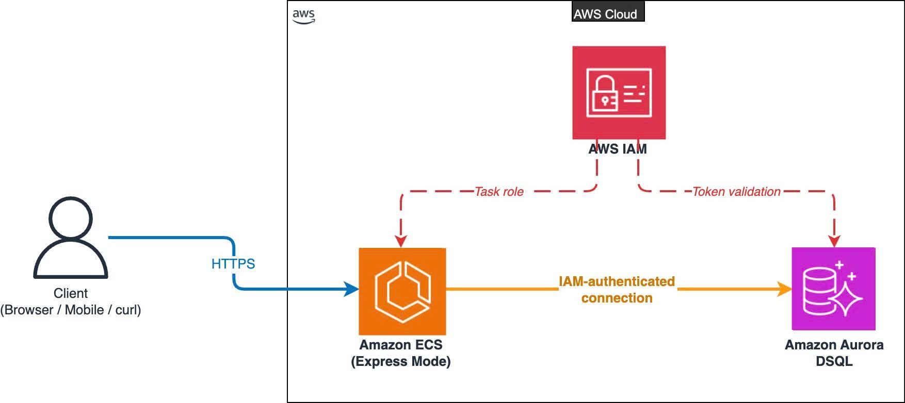

# Data Masking in Amazon RDS for Oracle

During my internship and while learning about AWS Database services, I came across an interesting AWS Database Blog discussing **Data Masking in Amazon RDS for Oracle**. Since this was a new topic for me, I would like to share what I learned from the article.

Previously, I thought that creating a **Development** or **UAT** environment simply meant restoring a backup from the **Production** database. However, after reading this article, I realized that this approach could expose a large amount of sensitive customer information.

Examples of sensitive data include:

- Full name
- Email address
- Phone number
- Home address
- Other personal information

If this data is copied directly into Development or Testing environments without protection, it may create serious security and privacy risks.

---

## What is Data Masking?

From my understanding, **Data Masking** is the process of replacing real data with fictional but realistic-looking data while preserving the original data format.

This allows developers and testers to work with realistic datasets without exposing actual customer information.

Example:

| Original Data | Masked Data |
|---------------|-------------|
| Nguyen Van A | Customer001 |
| loc@gmail.com | user001@example.com |
| 0909123456 | 0909XXXXXX |

---

## Workflow

The following diagram illustrates the automated Data Masking workflow on AWS.

> *Figure 1. Automated Data Masking workflow for Amazon RDS for Oracle.*

Based on the architecture diagram, I understand the process as follows:

### 1. Amazon EventBridge Scheduler

Amazon EventBridge Scheduler automatically starts the workflow based on a predefined schedule. This eliminates the need to execute the process manually every time data needs to be refreshed.

### 2. Restore Production Snapshot

A snapshot of the Production database is restored into a temporary Amazon RDS instance, which will be used for the masking process.

### 3. AWS Secrets Manager

Instead of storing database credentials directly in scripts or source code, the credentials are securely managed using AWS Secrets Manager. This follows AWS security best practices.

### 4. Perform Data Masking

After the temporary database has been restored, AWS Systems Manager executes masking scripts to replace sensitive information such as names, email addresses, and phone numbers.

### 5. Create a New Snapshot

Once the masking process is complete, a new database snapshot containing only masked data is created.

### 6. Restore for Development or UAT

Finally, the masked snapshot is restored into a Development or UAT environment, allowing developers and testers to work with safe, non-sensitive data.

---

## What I Found Interesting

The most interesting part of this solution is that AWS not only provides a way to mask sensitive data but also automates the entire process using multiple AWS services.

The solution integrates several AWS services, including:

- Amazon EventBridge Scheduler
- AWS Step Functions
- AWS Systems Manager
- AWS Secrets Manager
- Amazon RDS for Oracle

Each service has a specific responsibility, making the workflow automated, reliable, and easier to manage.

---

## What I Learned

After reading this article, I learned several important lessons:

- Production data should never be used directly in Development or Testing environments.
- Data Masking protects sensitive information while preserving data usability.
- AWS Secrets Manager provides a secure way to manage database credentials.
- Automating database operations with AWS services reduces manual effort and minimizes human error.

---

## Conclusion

This article introduced me to a practical approach for protecting sensitive data in cloud environments.

I realized that cloud security is not only about encryption and access control but also about ensuring that sensitive information remains protected when databases are copied into Development or Testing environments.

Overall, this solution demonstrates how AWS services can be combined to improve both security and operational efficiency.

---

## Reference

AWS Database Blog – **Data Masking in Amazon RDS for Oracle**

https://aws.amazon.com/vi/blogs/database/data-masking-in-amazon-rds-for-oracle/

This blog post was published in the **AWS Study Group VN** community on July 7, 2026

https://www.facebook.com/groups/awsstudygroupfcj/permalink/2206764610088499/?rdid=6jucykm1JYcH5g00#