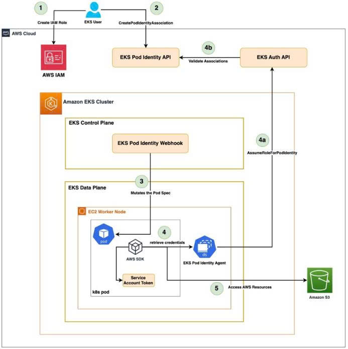

# Optimizing Kubernetes Security with Session Policies in Amazon EKS Pod Identity

During my internship, I learned about a solution that helps simplify permission management in Amazon EKS while improving security. The solution combines **Amazon EKS Pod Identity** with **Session Policies** to provide a more centralized and scalable access control mechanism for Kubernetes workloads.

Instead of creating and managing a large number of IAM Roles for each application, this approach allows multiple workloads to share IAM Roles while restricting permissions dynamically at runtime.

---

## Challenges with the Traditional IRSA Approach

Before Amazon EKS Pod Identity, AWS permissions were commonly managed using **IAM Roles for Service Accounts (IRSA)**. Although effective, this approach introduces several operational challenges in large Kubernetes environments.

Some common issues include:

- A large number of IAM Roles must be created to follow the Least Privilege principle.
- Mapping Kubernetes Service Accounts to IAM Roles requires manual configuration.
- Development teams often reuse IAM Roles with excessive permissions to reduce management effort, increasing security risks.

As the number of microservices grows, managing IAM Roles becomes increasingly complex.

---

## Architecture Overview

The solution introduces a three-layer architecture for identity and permission management.

> *Figure 1. Amazon EKS Pod Identity architecture with Session Policies.*

The architecture consists of the following layers.

### 1. Identity Layer

Applications run as Pods inside an Amazon EKS cluster.

Each Pod is associated with a Kubernetes Service Account instead of directly referencing an IAM Role. The relationship between the Service Account and the IAM Role is managed by the **Amazon EKS Pod Identity Agent**.

### 2. Policy and Control Layer

A **Pod Identity Association** maps a Kubernetes Service Account to a shared IAM Role.

Whenever a Pod requests AWS credentials, **AWS Security Token Service (STS)** generates temporary credentials and automatically applies a **Session Policy**.

The effective permissions are the intersection between:

- IAM Role permissions
- Session Policy permissions

This mechanism further limits the permissions available to each Pod without requiring additional IAM Roles.

### 3. Target Resource Layer

After temporary credentials are issued, the application can securely access AWS resources such as:

- Amazon S3
- Amazon DynamoDB
- Amazon SQS

These AWS services receive requests with scoped-down permissions while remaining independent of the Kubernetes cluster implementation.

---

## What I Found Interesting

The most interesting part of this solution is that AWS separates identity management from permission control.

Instead of creating hundreds of IAM Roles, administrators can reuse a smaller number of IAM Roles while using Session Policies to dynamically restrict permissions for each workload.

This makes the system easier to manage and significantly improves security.

---

## What I Learned

After reading this article, I learned several important concepts:

- Amazon EKS Pod Identity simplifies AWS authentication for Kubernetes workloads.
- Session Policies provide an additional security layer by limiting permissions at runtime.
- Sharing IAM Roles combined with Session Policies reduces IAM Role sprawl.
- Centralized permission management improves scalability and simplifies operations.
- Applying the Least Privilege principle becomes easier in large Kubernetes environments.

---

## Conclusion

This article helped me understand a modern approach to managing AWS permissions for Kubernetes applications.

Compared with the traditional IRSA approach, Amazon EKS Pod Identity combined with Session Policies reduces operational complexity while improving security. It enables organizations to manage permissions more efficiently without sacrificing the principle of least privilege.

Overall, I believe this solution is a valuable enhancement for organizations running large-scale applications on Amazon EKS.

---

## Reference

AWS Containers Blog – **Optimize Kubernetes security with Session Policies in Amazon EKS Pod Identity**

https://aws.amazon.com/blogs/containers/

This blog post was published in the **AWS Study Group VN** community on July 6, 2026.

https://www.facebook.com/groups/awsstudygroupfcj/permalink/2206037506827876/?rdid=aJJTfyKFrzCzEko6#