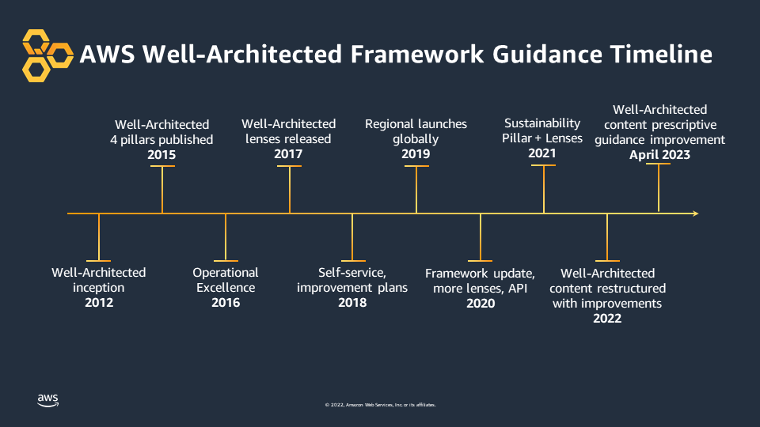
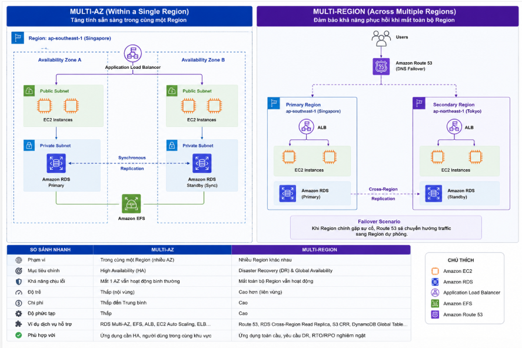

# AWS Well-Architected Framework: Tư Duy Thiết Kế Đám Mây Không Ngừng Tiến Hóa
Xây dựng một hệ thống trên nền tảng điện toán đám mây (Cloud) không đơn thuần là việc "kéo thả" các dịch vụ lại với nhau. Nó đòi hỏi một tư duy kiến trúc vững chắc và một chiến lược dài hạn. Gần đây, mình có đọc bài viết *“Announcing updates to the AWS Well-Architected Framework guidance”* trên AWS Architecture Blog và nhận ra một thông điệp rất rõ ràng: **AWS Well-Architected Framework (WAF) không phải là một bộ checklist tĩnh, mà là một cuốn cẩm nang sống động.**

Bài viết này sẽ chia sẻ lại những góc nhìn thú vị từ bản cập nhật mới nhất của AWS và cách nó thay đổi tư duy thiết kế hệ thống của chúng ta.

## 1. Một Framework không ngừng tiến hóa cùng công nghệ

Nhìn vào lịch sử phát triển của Well-Architected Framework, chúng ta có thể thấy rõ sự chuyển mình liên tục để bám sát các thực tiễn vận hành thực tế (best practices):

*Hình 1: Dòng thời gian phát triển của AWS Well-Architected Framework qua các năm.*

* **2012:** Khởi nguồn những khái niệm đầu tiên về Well-Architected.
* **2015:** Chính thức ra mắt với 4 trụ cột cơ bản.
* **2016 - 2020:** Bổ sung trụ cột **Operational Excellence** (Vận hành xuất sắc), ra mắt các "Lenses" (lăng kính) dành riêng cho từng đặc thù ngành, và cung cấp API để tự động hóa đánh giá.
* **2021:** Nắm bắt xu hướng toàn cầu, AWS bổ sung trụ cột thứ 6 – **Sustainability** (Bền vững), hướng tới điện toán xanh.
* **2023:** Tái cấu trúc và cải thiện nội dung hướng dẫn mang tính thực tiễn cao (prescriptive guidance).

AWS không tự "nghĩ" ra bộ khung này trong phòng kín. Nó được nhào nặn từ kinh nghiệm giải quyết sự cố, triển khai và tối ưu hệ thống cho hàng trăm ngàn doanh nghiệp trên toàn thế giới.

## 2. Nghệ thuật cân bằng 6 trụ cột cốt lõi

Hiện tại, WAF bao gồm 6 trụ cột:
1.  **Operational Excellence** (Vận hành xuất sắc)
2.  **Security** (Bảo mật)
3.  **Reliability** (Độ tin cậy)
4.  **Performance Efficiency** (Hiệu suất hoạt động)
5.  **Cost Optimization** (Tối ưu chi phí)
6.  **Sustainability** (Bền vững môi trường)

Điểm nhấn quan trọng mà bài viết của AWS chỉ ra là: **Chúng ta cần xem xét đồng thời 6 trụ cột này thay vì cố gắng tối ưu chúng một cách riêng lẻ.** Thiết kế kiến trúc là nghệ thuật của sự đánh đổi (trade-offs). Bạn muốn hệ thống đạt độ tin cậy (Reliability) 99.999%? Chi phí (Cost) chắc chắn sẽ đội lên rất cao do phải thiết lập đa vùng (Multi-Region) dự phòng. Bạn muốn đẩy mạnh hiệu năng (Performance)? Lượng điện năng tiêu thụ (Sustainability) có thể sẽ bị ảnh hưởng. Khung WAF giúp chúng ta có cái nhìn toàn cảnh để đưa ra quyết định đánh đổi sáng suốt nhất, phù hợp nhất với giai đoạn kinh doanh hiện tại của công ty.

## 3. Phá vỡ ranh giới giữa Kỹ thuật và Chiến lược Kinh doanh

Một sai lầm kinh điển khi tiếp cận Well-Architected Framework là nghĩ rằng bộ khung này chỉ dành riêng cho các kỹ sư Solutions Architect hoặc DevOps. Thực tế, bản cập nhật mới của AWS ngày càng nhấn mạnh vào tính kết nối toàn diện trong doanh nghiệp.

*Hình 2: Luồng thông tin xuyên suốt giữa các bộ phận theo tư duy Well-Architected.*

Nhìn vào sơ đồ trên, chúng ta có thể thấy hệ thống được chia làm 3 miền (domain) rõ rệt nhưng có mối quan hệ hữu cơ chặt chẽ:
* **Finance (Tài chính):** Quản lý ngân sách và báo cáo tài chính (liên quan trực tiếp đến trụ cột *Cost Optimization*).
* **Engineering (Kỹ thuật):** Chịu trách nhiệm đưa ra quyết định kiến trúc và xử lý sự cố (liên quan đến *Operational Excellence* và *Reliability*).
* **Executive (Ban điều hành):** Đưa ra chiến lược phát triển và các thương vụ mua bán sáp nhập (M&A).

Các **đường mũi tên đứt nét** chính là minh chứng cho tư duy Well-Architected: Ban điều hành không thể đưa ra chiến lược kinh doanh đúng đắn nếu không có cái nhìn thấu suốt vào các quyết định kiến trúc (Microservices hay Monolith) của phòng kỹ thuật, cũng như tình hình tối ưu chi phí từ phòng tài chính. Một hệ thống đám mây "chuẩn chỉnh" phải là bệ phóng giúp các ranh giới này mờ đi, cho phép dữ liệu và các quyết định công nghệ phục vụ trực tiếp cho mục tiêu cốt lõi của doanh nghiệp.

## 4. Đánh giá kiến trúc là một hành trình, không phải đích đến

Đây có lẽ là điểm mình ấn tượng nhất: *Việc đánh giá kiến trúc nên là một quá trình liên tục trong suốt vòng đời của hệ thống, không chỉ thực hiện một lần khi triển khai ban đầu.*

Nhiều dự án có thói quen review hệ thống rất kỹ trước ngày Go-live, và sau đó bỏ bẵng. Tuy nhiên, trên môi trường Cloud, mọi thứ thay đổi từng ngày:
* Lượng truy cập của người dùng thay đổi.
* AWS liên tục ra mắt các loại Instance mới rẻ hơn, mạnh hơn.
* Các mô hình kiến trúc mới (như Microservices hay Serverless) trở nên phổ biến hơn.

Một hệ thống "Well-Architected" của năm ngoái hoàn toàn có thể trở thành "Legacy" (lỗi thời) vào năm nay nếu không được rà soát. Do đó, việc sử dụng AWS Well-Architected Tool để tự đánh giá lại hệ thống nên được lên lịch định kỳ (ví dụ: mỗi quý hoặc mỗi nửa năm).

## Lời kết

Bài thông báo cập nhật của AWS tuy ngắn gọn nhưng mang lại giá trị cốt lõi rất lớn. Nó giúp các kỹ sư Cloud và DevOps hiểu rằng: Học AWS không chỉ là học cách sử dụng EC2, S3 hay Lambda, mà cao hơn cả là hình thành **tư duy thiết kế** sao cho an toàn, hiệu quả và linh hoạt nhất. 

## Tài liệu tham khảo

AWS Containers Blog – **AWS Well-Architected Framework: Tư Duy Thiết Kế Đám Mây Không Ngừng Tiến Hóa**

https://aws.amazon.com/blogs/containers/

Bài blog được đăng lên nhóm **AWS Study Group VN** - *Ngày 07-07-2026*

https://www.facebook.com/groups/awsstudygroupfcj/permalink/2207230430041917/?rdid=hgn4tpJq62kSNHHu#