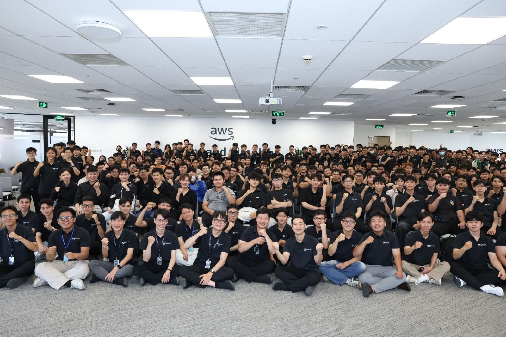
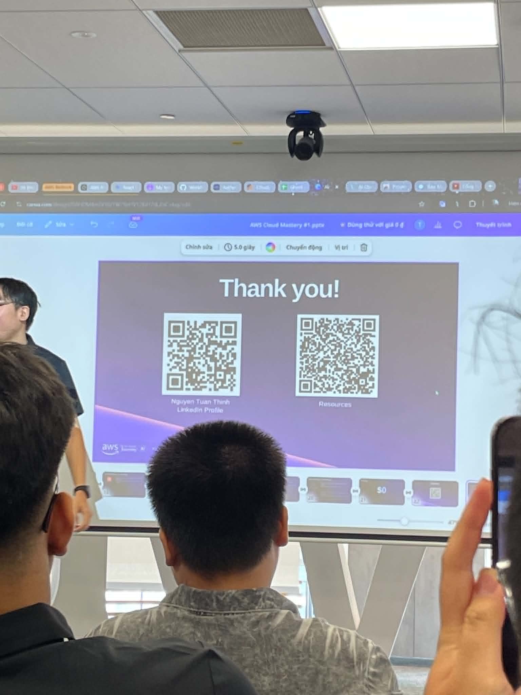
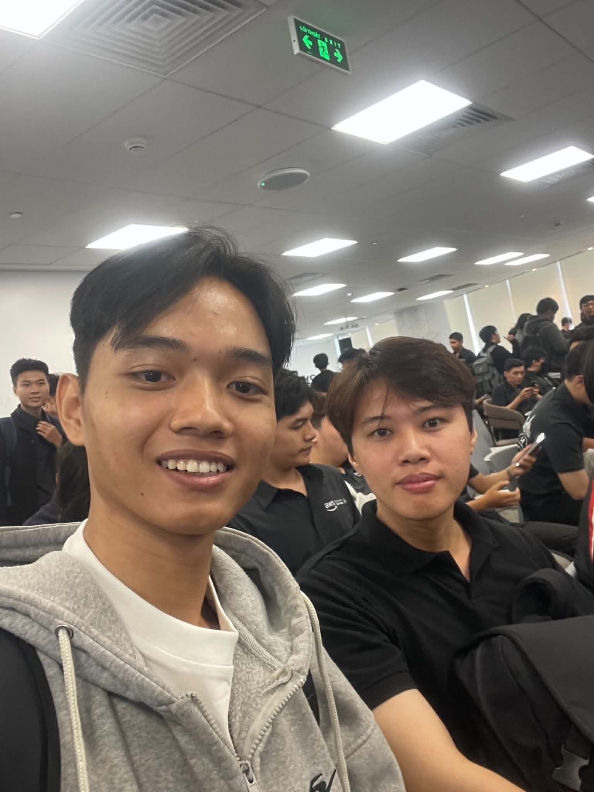

# Bài thu hoạch “Cách học sao cho hợp lý & Trí tuệ nhân tạo (AI)”

### Mục Đích Của Sự Kiện

- Khám phá hệ thống phần thưởng của não bộ (Dopamine) để tối ưu hóa động lực và khả năng tiếp thu.
- Chia sẻ các kỹ thuật Cognitive Learning (Học tập nhận thức) để đạt trạng thái "Deep Work".
- Giới thiệu phương pháp Automated Prompt Engineering giúp tối ưu hóa việc sử dụng các mô hình ngôn ngữ lớn (LLM).
- Hướng dẫn cấu trúc lệnh (Prompt) chuẩn xác, các kỹ thuật AI nâng cao và bài toán tối ưu chi phí (Token Economics).

### Danh Sách Diễn Giả

- **Huỳnh Hoàng Long** - Diễn giả về phương pháp học tập & Cognitive Learning
- **Nguyễn Tuấn Thịnh** - Chuyên gia về Trí tuệ nhân tạo (AI) & Prompt Engineering

### Nội Dung Nổi Bật

#### The Dopamine System trong học tập (Huỳnh Hoàng Long)

- **Hacking the Reward Pathway**: Dopamine không sinh ra từ sự thỏa mãn, mà từ **sự mong đợi (anticipation)**. Cần cấu trúc việc học để tạo ra các vòng lặp động lực liên tục thông qua các "chiến thắng nhỏ" (small wins).
- **Cognitive Learning Routine**:
    - **Brain Manipulation**: Dành 2 phút trước khi học để tưởng tượng bản thân đã nắm vững được kiến thức.
    - **Environment Reset**: Cách ly điện thoại/mạng xã hội 30 phút trước khi bước vào trạng thái tập trung sâu.
    - **Pomodoro Technique**: Sprint 25 phút tập trung cao độ, sau đó phục hồi chủ động (không dùng thiết bị điện tử).
    - **Celebrate Micro-Wins**: Mỗi đoạn tài liệu/đoạn code hoàn thành là một trigger tạo Dopamine cho bước tiếp theo.

#### Automated Prompt Engineering (Nguyễn Tuấn Thịnh)

- **Tại sao Engineering lại quan trọng?**: Giảm 60% kết quả không nhất quán so với prompt chung chung; tránh lãng phí token, tiết kiệm thời gian và tối ưu chi phí API.
- **Cấu trúc của một Perfect Prompt**:
    - **Role**: Xác định vai trò của AI (VD: Senior Security Analyst, Expert Java Developer).
    - **Instruction**: Yêu cầu/nhiệm vụ cụ thể với ngôn từ mang tính chỉ đạo.
    - **Context**: Ngữ cảnh, dữ liệu nền tảng, hoặc lịch sử hệ thống.
- **Kỹ thuật nâng cao**:
    - **Chain-of-Thought (CoT)**: Ép AI suy luận từng bước để tăng độ chính xác logic.
    - **Tree-of-Thoughts (ToT)**: Khám phá nhiều nhánh suy luận và chọn con đường logic nhất.
    - **RAG**: Tích hợp cơ sở dữ liệu ngoài để chống "ảo giác" (hallucinations).
- **Kiến trúc & Kinh tế học (Token Economics)**: Ứng dụng AI vào tự động hóa SDLC. Hiểu rõ công thức tính chi phí dựa trên Input/Output tokens để không bị lãng phí tài nguyên.

### Những Gì Học Được

#### Tư Duy Học Tập & Làm Việc

- **Quy trình tối ưu hóa não bộ**: Hiểu được cơ chế sinh học đằng sau sự chán nản hay mất tập trung, từ đó biết cách "hack" động lực của chính mình.
- **Tư duy giao tiếp với máy**: Chuyển từ việc "hỏi AI" sang "thiết kế ngữ cảnh và chỉ thị cho AI" một cách có hệ thống và khoa học.

#### Kiến Trúc Kỹ Thuật

- **Quản lý trạng thái học tập**: Áp dụng triệt để Pomodoro kết hợp với Digital Detox ngắn hạn để duy trì sự bền bỉ.
- **Integration AI Tools**: Biết khi nào nên dùng CoT, ToT hay RAG tùy thuộc vào độ phức tạp của bài toán lập trình.
- **SDLC Automation**: Tích hợp AI vào từng khâu: Plan → Code → Refactor (Prompt optimization) → Deploy.

### Ứng Dụng Vào Công Việc & Học Tập

- **Setup lại môi trường**: Áp dụng quy tắc "Environment Reset" (tắt điện thoại 30 phút trước khi bắt đầu) để giữ sự tập trung cao độ khi nghiên cứu các kiến trúc phần mềm hoặc cấu hình hệ thống.
- **Thiết kế Prompt chuẩn hóa**: Sử dụng format (Role - Instruction - Context) khi nhờ AI debug các logic phức tạp trong backend (như Spring Boot, Flask) hay khi phân tích cấu trúc RESTful API thay vì hỏi những câu chung chung.
- **Áp dụng Chain-of-Thought (CoT)**: Sử dụng kỹ thuật này ép AI phân tích logic từng bước khi cần thiết lập rule cho Wazuh, OPNsense firewall hoặc khi bóc tách các log hệ thống bảo mật phức tạp.
- **Chia nhỏ task (Micro-wins)**: Chia nhỏ các project thực tế thành các endpoint/module siêu nhỏ để tận dụng cơ chế tiết Dopamine, giữ lửa trong các phiên làm việc dài.

### Trải nghiệm trong event

Tham gia sự kiện kết hợp giữa **Tâm lý học thần kinh** và **Trí tuệ nhân tạo** là một trải nghiệm mở mang tầm mắt, giúp tôi hiểu rằng công nghệ tiên tiến nhất cũng cần một bộ não được chuẩn bị tốt nhất để làm chủ. Một số trải nghiệm nổi bật:

#### Học hỏi từ các diễn giả có chuyên môn
- Diễn giả Huỳnh Hoàng Long đã bóc tách rõ ràng cơ chế khoa học của động lực, giúp tôi giải đáp được tại sao mình hay bị trì hoãn và có phương pháp khắc phục tận gốc.
- Diễn giả Nguyễn Tuấn Thịnh mang đến góc nhìn thực tế, sành sỏi về mặt kỹ thuật, đặc biệt là bài toán tối ưu chi phí (Token Economics) rất quan trọng khi làm việc sâu với AI API.

#### Trải nghiệm kỹ thuật & Phương pháp thực tế
- Thích thú nhất với khái niệm **"Brain Manipulation"** và sự khác biệt rõ rệt về chất lượng code/câu trả lời khi so sánh một Prompt thông thường với Prompt được cấu trúc theo **Tree-of-Thoughts**. Nó thay đổi hoàn toàn cách tôi tận dụng các công cụ LLM hiện nay.

#### Kết nối và trao đổi
- Workshop tạo không khí cởi mở. Việc kết hợp một chủ đề về "con người" (cách bộ não hoạt động) và một chủ đề về "máy móc" (Prompt Engineering) giúp các cuộc thảo luận trở nên đa chiều và bổ ích.

#### Bài học rút ra
- AI là một đòn bẩy tuyệt vời, nhưng để sử dụng đòn bẩy đó, bản thân mình phải có sự tập trung và kỷ luật. Việc kết hợp quản lý Dopamine và sử dụng AI tối ưu sẽ là "vũ khí" đắc lực cho chặng đường học tập sắp tới.

#### Một số hình ảnh khi tham gia sự kiện

> Tổng thể, sự kiện không chỉ cung cấp các kỹ thuật AI hiện đại mà còn "nâng cấp" luôn cả phương pháp làm việc của bản thân tôi, giúp tôi sẵn sàng và tự tin hơn để giải quyết các hệ thống phức tạp.