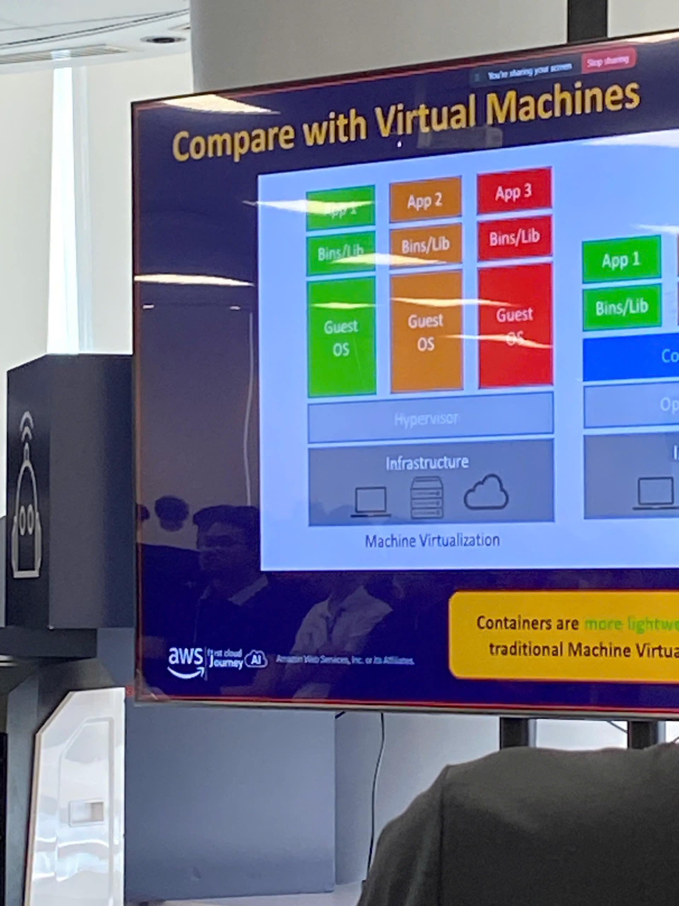
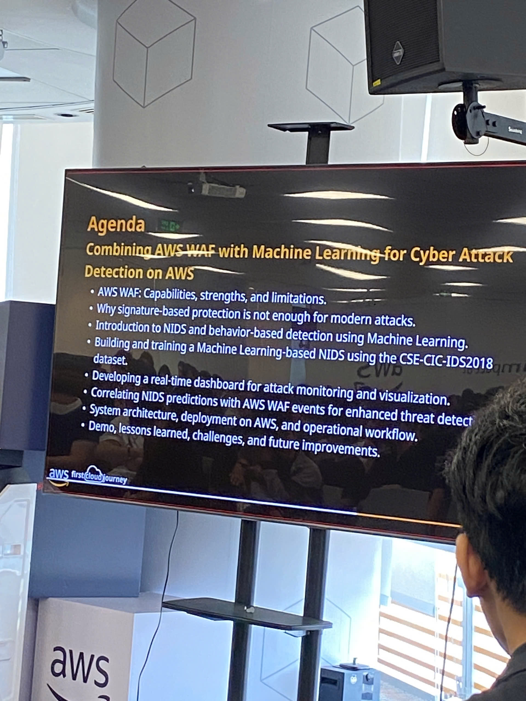
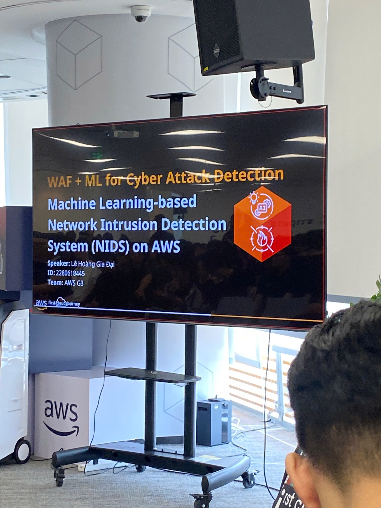

# Event Report: "AWS First Cloud Journey: From Virtualization and Serverless to AI in Security"

Hello everyone! As an intern at AWS, I recently had the incredible opportunity to attend an insightful event called "AWS First Cloud Journey." This wasn't just a theoretical seminar; it was a highly practical deep dive into modern infrastructure architectures, real-world serverless challenges, and the fascinating intersection of AI and cloud security.

Below is the summary of the key takeaways and personal insights I gathered from the event.

---

### Event Objectives

The event was designed to provide a comprehensive, industry-level overview of the AWS ecosystem, enabling participants to:
- Explore the Cloud Journey: Understand the practical path of migrating from traditional legacy infrastructure to AWS Cloud.
- Analyze Modern Architectures: Deep dive into the comparison between Virtualization (VMs) and Containerization (Docker) to optimize resource utilization.
- Confront Serverless Realities: Identify technical bottlenecks and cost-efficiency trade-offs when operating serverless architectures (AWS Lambda, DynamoDB).
- AI in Security: Implement Machine Learning alongside AWS WAF to build intelligent Network Intrusion Detection Systems (NIDS).
- Career Orientation: Learn from real-world experiences on shifting from Helpdesk/Sysadmin roles toward a DevOps career path.

### Speakers & Agenda

The journey was led by seasoned industry experts:
- 09:20 - 10:00 | Nguyen Quoc Bao
- 10:00 - 10:35 | Nguyen Huynh Quoc Bao
- 10:35 - 10:50 | Viet Phat
- 10:50 - 11:10 | Le Hoang Gia Dai - Security Expert
    - Topic: WAF + ML for Cyber Attack Detection
- 11:10 - 12:00 | Tran Trung Vinh
    - Topic: Career Journey from Sysadmin to DevOps & Interview Insights at Central Retail Group

*(Note: In-depth technical sessions on Containers and Serverless were distributed throughout the morning slots hosted by speakers Quoc Bao, Huynh Quoc Bao, and Viet Phat).*

---

### Key Highlights & Technical Insights

#### 1. Architectural Showdown: Virtual Machines vs Containers

This introductory session perfectly clarified the evolution of infrastructure deployment models.
- Core Differences: VMs are fundamentally "heavyweight" because each virtual machine runs its own dedicated Guest OS on top of a hypervisor, resulting in slower boot times (minutes) and high resource overhead. Conversely, Containers (Docker) are "lightweight"—they share the host OS kernel and spin up in milliseconds.
- Optimization: Containers package the application along with its specific binaries and libraries, delivering near-native performance, drastic RAM savings, and the ability to run hundreds or thousands of containers on the same underlying hardware instead of just a few dozen VMs.

#### 2. Practical Challenges in Serverless Deployments (AWS Lambda & DynamoDB)

Serverless is not a silver bullet. This segment focused on the hard-learned lessons encountered during production scale-up.
- State Management (Stateless Lambda): AWS Lambda does not preserve memory state between separate requests. Consequently, application states (e.g., player game states) must be constantly queried and written to DynamoDB, requiring highly decoupled architectural designs to eliminate latency.
- Cost Hazards (DynamoDB Scan Cost): A crucial takeaway regarding database operations—using the ScanCommand to retrieve data by scanning an entire table gets significantly slower and exponentially more expensive as the system grows. The system must be optimized using targeted Queries and Secondary Indexes instead.
- Handling Dead Connections (GoneException): Properly cleanup abrupt player disconnections so that the matchmaking engine does not waste resources broadcasting messages to stale connection IDs.

#### 3. WAF & Machine Learning for Network Intrusion Detection System (Le Hoang Gia Đại)

An advanced session detailing how to bolster edge security by augmenting traditional web application firewalls with AI capabilities.
- Limitations of Signature-based Rules: The speaker broke down why static, signature-based rules in traditional firewalls are no longer sufficient to mitigate modern attack vectors such as zero-day exploits and behavior anomalies.
- Behavior-based NIDS with ML: Utilizing Machine Learning models trained on standardized datasets like CSE-CIC-IDS2018 to perform anomaly detection based on traffic patterns.
- Operational Workflow: Deploying a real-time monitoring dashboard, then correlating NIDS predictions with active AWS WAF events to dramatically reduce false positives and enhance cloud threat detection.

#### 4. Career Evolution: From Sysadmin to DevOps (Tran Trung Vinh)

The final session offered profound career advice and actionable guidance for students entering the IT workforce.
- Mindset Shift: Cloud computing isn't merely a shift in tools; it demands a cultural change. It requires moving away from manual configurations toward complete automation via Infrastructure as Code (IaC).
- Interview Wisdom: Crucial career lessons and personal growth strategies gained from navigating rigorous technical interviews at major enterprises like Central Retail Group.

---

### Event Gallery

---

### Key Takeaways

#### Architecture & Cloud Mindset
- Right Tool for the Right Job: No technology is flawlessly ideal for every situation. You must evaluate cost versus performance tradeoffs when choosing between VMs and containers, or when designing database structures (e.g., Scan vs. Query).
- DevOps Principles: Modern infrastructure is now defined as software. System reliability depends entirely on effective automation, logging, and robust observability.

#### Modern Security Principles
- Moving beyond static rulesets is imperative. Contemporary cybersecurity frameworks must integrate AI/ML models to actively evaluate behavioral anomalies in network traffic rather than relying solely on known threat databases.

### Action Plan & Practical Applications

- Containerizing Personal Projects: Instead of running applications like Spring Boot or Flask directly on my host machine—which often leads to environment conflicts—I will begin writing Dockerfiles to containerize my web applications for seamless deployment.
- Advancing Security Analytics: The concepts shared during the WAF + ML session perfectly align with my research goals in security. I plan to apply these log correlation strategies to SIEM systems to draft more efficient custom detection rules for my projects.
- Cloud Cost Management: In any future AWS prototype deployments, the lessons on DynamoDB scaling costs will serve as a strong reminder to structure my data efficiently, ensuring my experimental systems remain well within the Free Tier limits.

---

### Personal Reflections

Attending the AWS First Cloud Journey event provided an invaluable, industry-first perspective that bridges the gap between standard textbook concepts and real-scale corporate engineering.

- Technical Value: Seeing the production-level architectures currently implemented by expert teams gave me a transparent view of what it takes to excel as a Cloud Infrastructure or Security Engineer. Openly breaking down the limitations of serverless models showcased the true maturity of the speakers' expertise.
- Career Guidance: The session tracing the career path from IT Helpdesk up to Sysadmin and DevOps was highly motivating. It provided a concrete roadmap, highlighting the exact technical stacks (from OS internals and networking to cloud architecture and automation) required to stand out in upcoming engineering interviews.
- Overall Impression: The event was professional yet remarkably open to student engagement. The practical application of AI to network security has inspired entirely new directions for the engineering projects I am pursuing.

> **Conclusion:** This event was the perfect bridge connecting the network administration and security principles I study in school with enterprise-grade cloud deployment standards. It has solidified my drive to master modern cloud infrastructure and integrate intelligent automation into security engineering workflows.